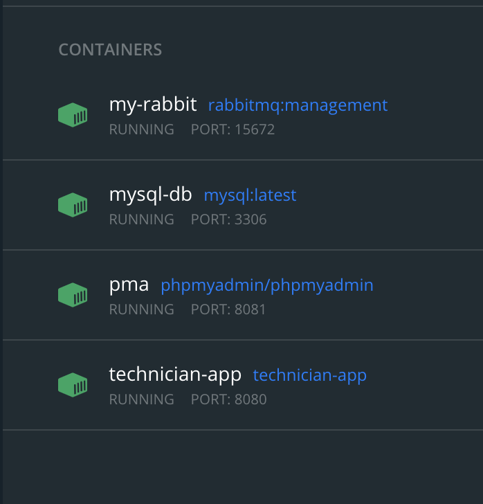

#### Technician-Assignment Project

##### Tech:

- Java (Spring boot framework)
- Docker Containerization (mysql, rabbitmq, phpmyadmin, technician app)
- Maven

#### Steps to run:

- Pre-requisite: Before running script make sure docker server is started
- If code shows permission issue run ```chmod +x ./startup-app.sh```

```cmd
./startup-app.sh
```
- Once you're done testing the app, you can run 

```cmd
./docker-compose down
```
to shutdown the app and remove the RabbmitMQ, MySql Docker containers and the SpringBoot app.

#### How to validate the results

To access the API via Swagger, head [to here ](http://localhost:8080/swagger-ui/index.html#/)

To check the database, head to [here](http://localhost:8081/) and use the following info:

- user: root
- password: spring
- server: db

And the schema is *demo*

#### Image Purpose:

1. **RabbitMQ**: To demonstrate the Message broker service (Port: 15672)
2. **Mysql**: For Data Storage (Port: 3306)
3. **PhpMyadmin**: MySQL UI Tool (Port: 8081)
4. **TechnicianApp**: Spring boot Assignment (Port: 8084)

#### Containers Running Snapshot

